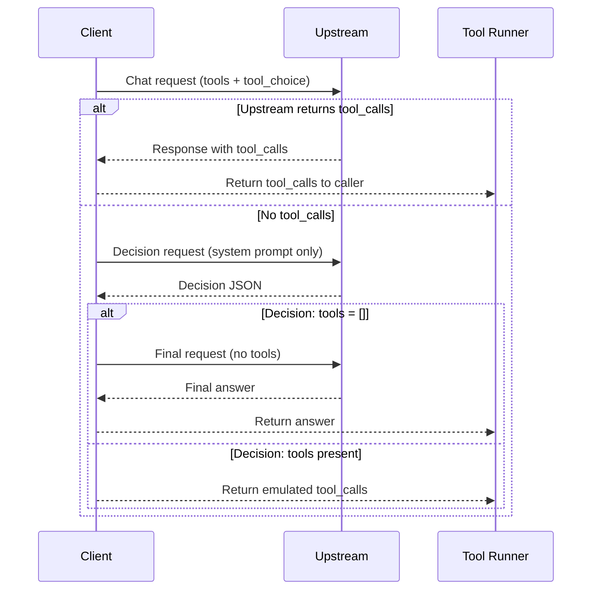

# Tool Emulation Flow

This document describes the current tool-emulation behavior in `uniai` as implemented in `tool_emulation.go`.

## When Emulation Triggers

Emulation runs only when:

- The request includes at least one tool, AND
- The upstream provider returns **no** `tool_calls` in its response.

If the upstream provider returns `tool_calls`, the response is returned as-is and emulation is skipped.

## Sequence Diagram

## Detailed Flow

1) **Initial upstream request**
   - The client sends the original request (including `tools` and `tool_choice`) to the upstream provider.
   - If `tool_calls` are present in the response, the client returns immediately.

2) **Build tool-decision request**
   - A new system prompt is generated that:
     - forces a strict JSON-only output format;
     - defines the allowed tool list and their JSON schemas;
     - includes any `tool_choice` constraint (none/required/function).
   - The request is cloned, then:
     - all existing **system** messages are removed;
     - `tools` and `tool_choice` are cleared;
     - the decision prompt is inserted as the only system message.

3) **Send decision request**
   - The decision request is sent to the same provider.

4) **Parse decision output**
   - The parser tries to extract JSON from the model output, even if it contains extra text.
   - Supported JSON formats:
     - `{ "tools": [ { "tool": "<name>", "arguments": { ... } } ] }`
     - `{ "tools": [] }`
     - legacy single-tool: `{ "tool": "<name>", "arguments": { ... } }`
   - The parser also handles JSON wrapped as a string and JSON inside code fences.
   - If `tool_choice` is `required` or `function`, a missing tool decision becomes an error.

5) **Enforce tool_choice**
   - If a tool decision exists, it is validated against `tool_choice`:
     - `none` rejects all tool calls.
     - `required` requires at least one tool call.
     - `function` requires exactly one call to the named tool.

6) **Branch: no tools**
   - If the decision indicates no tools, the client issues a second request:
     - original messages;
     - `tools` and `tool_choice` removed.
   - The final assistant response is returned.
   - `Warnings` includes `"tool calls emulated"`.

7) **Branch: tool calls**
   - Each emulated tool call is converted into a `ToolCall` with an ID like
     `emulated_<unix_nano>_<idx>`.
   - The response returns **only** `ToolCalls` (no assistant text).
   - `Warnings` includes `"tool calls emulated"`.

## Tool Execution

Tool execution is **not** automatic. The caller must:

1) Execute the tool(s) from the returned `ToolCalls`.
2) Send tool results back via `RoleTool` messages.
3) Call `Chat` again to obtain the final assistant response.

## Notes / Limitations

- Only tools of type `function` are included in the decision prompt.
- The decision parser is tolerant of extra text, but if no valid tool JSON is found:
  - it returns a "no tools" decision (unless `tool_choice` forbids that).
- Emulation is a fallback and depends on model compliance with the decision prompt.
